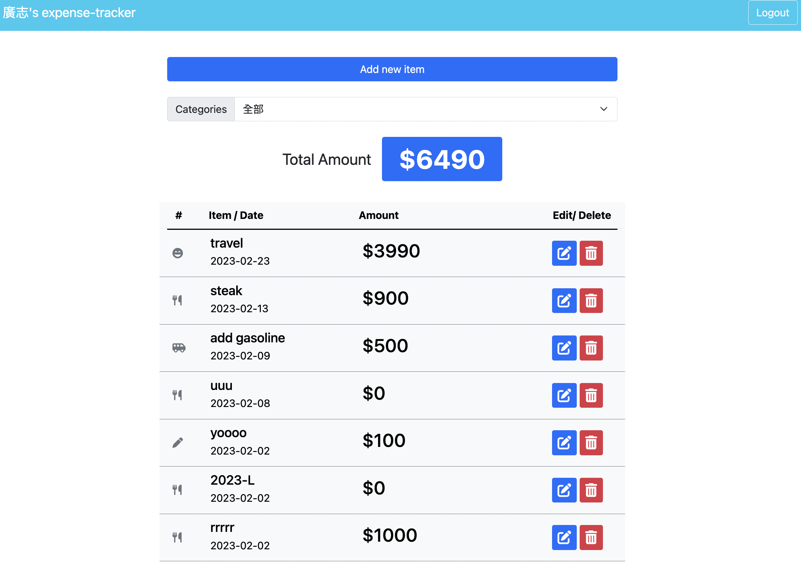
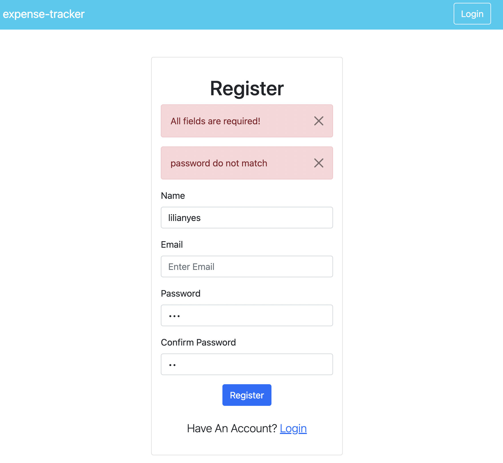
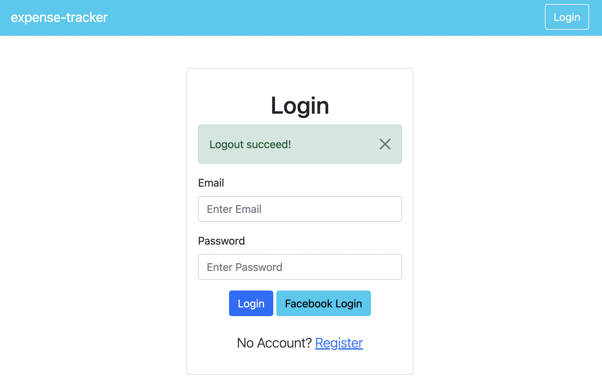
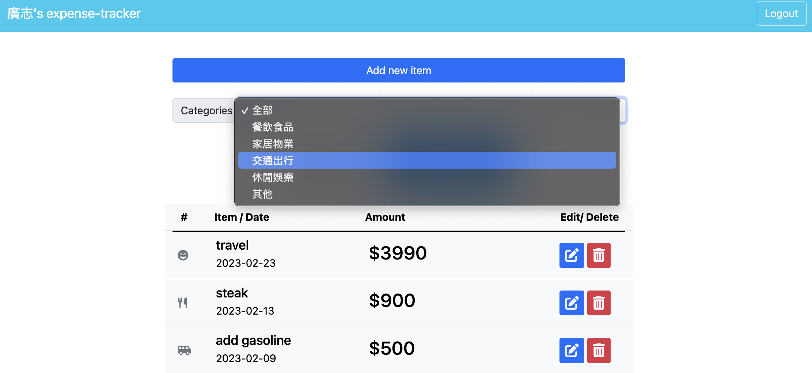
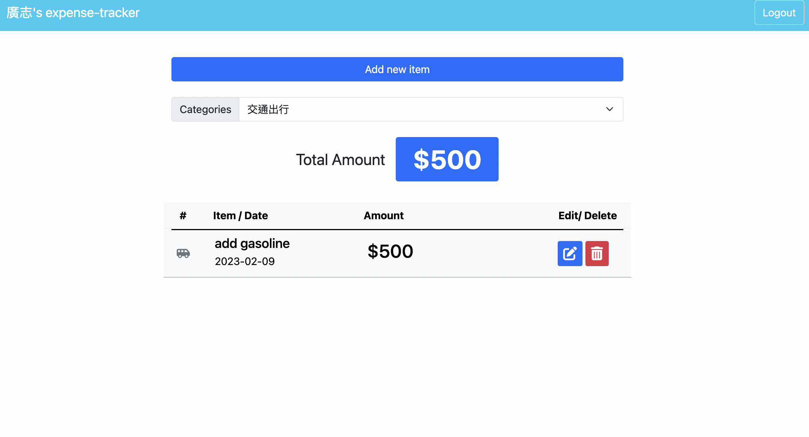
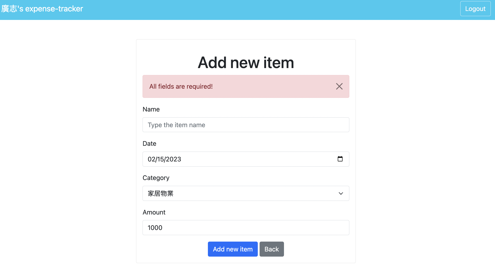
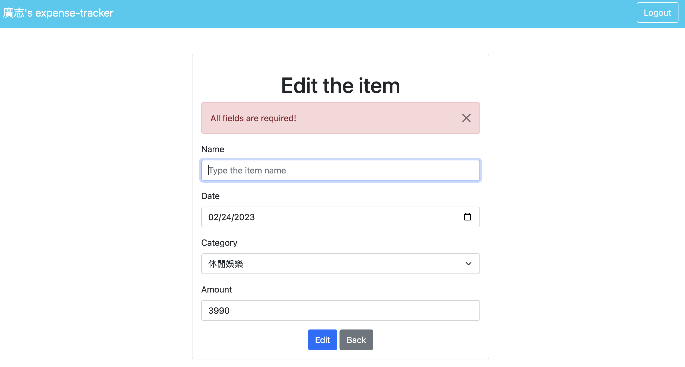

# Expense Tracker

## 📖 Introduction
This website is an expense tracker which contains all expenses and can track every expense record. Moreover, you can log in via a local or FB account, and every user has their own account.



## 🎮 Features
Users can register for an account and then use their login information to access it




Users can overview all expenses, including:
- Item name
- Item category
- Item amount
- Date when expense

Users can use the search bar to categorize all expenses, including:
- Item name
- Item category
- Item amount
- Date when expense



Users can add a new item, including:
- Item name
- Item category
- Item amount
- Date when expense


Users can edit an item, including:
- Item name
- Item category
- Item amount
- Date when expense


Finally, Users can delete a restaurant from the list
- Reminder will show when click a delete button

Some warning & success messages
- Register page
    - All fields are required
    - The Email is already registered
    - The password do not match
- Login page
    - Email or password error
    - All fields are required!
- add new item/ edit item
    - All fields are required

## 🛠️ Installation
```
# Clone this repository
$ git clone https://github.com/Lilynews/expense-tracker.git

# Confirmed the terminal is at the project
cd expense-track

# Project setup
$ npm install

# add the file of .env, and set up the DB_URL
MONGODB_URL=mongodb+srv://<account>:<password>@cluster0.<xxxxx>.mongodb.net/<table>?retryWrites=true&w=majority

# Before active project, need to create seeder in DB, type
$ npm run seed

after setup, type
$ npm run start

# if the message shows like below, please open the web page and type the URL: http://localhost:3000, and you can enter this website.
"Express is listening on localhost:3000"
"mongodb connected!"

# To stop the project
ctrl + c
```

## 🥷🏻 Prerequisites
- [Git](https://git-scm.com/downloads)
- [Node.js](https://nodejs.org/en/)
- [Express](https://expressjs.com/)
- [mongoDB](https://www.mongodb.com/)

## 👩🏻‍💻 Tech/framework used
- VScode 1.73.1
- Express 4.16.4
- Express-handlebars 4.0.2
- Express-session: 1.17.1
- bcryptjs 2.4.3
- connect-flash 0.1.1
- method-override 3.0.0
- moment 2.29.4
- mongoose: 5.9.7
- passport 0.4.1
- passport-facebook 3.0.0
- passport-local 1.0.0
- dotenv 16.0.3
- bootstrap 5.1.3
- font-awesome

## 🗺️ Roadmap
- Home page
    - sort by
        - [ ]  year
        - [ ]  month
        - [ ]  time or name：A → Z & Z→A
        - [ ]  location
    - filter
        - [ ]  item name
        - [x]  category
    - [ ]  pagination
    - [ ]  Save category selected value to new page
- New page
    - [ ]  alert-message: The table format is not compliant
    - [x]  Save form value when an error occurs
- Edit page
    - [ ]  alert-message: The table format is not compliant
    - [x]  Save form value when an error occurs
- Login page
    - [ ]  forgot passport setting
    - alert-message:
        - [x]  Email or password error
        - [x]  All fields are required!
        - [x]  Login before use
- Register page
    - [ ]  Google register
    - [ ]  email verification
    - alert-message:
        - [x]  All fields are required
        - [x]  The Email is already registered
        - [x]  The password do not match
        - The table format is not compliant
            - [ ]  Password characters do not comply with the format
            - [ ]  Email format
- views
    - [ ]  chart.js
- function
    - [ ]  CRUD category
    - [ ]  add revenue subject
    - [ ]  detail page
        - [ ]  add description